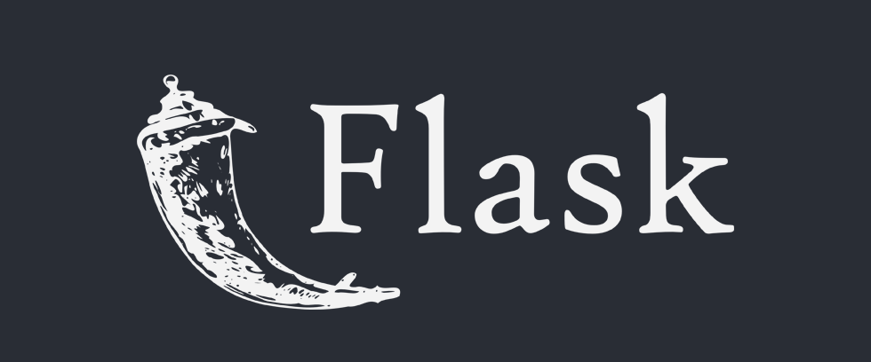
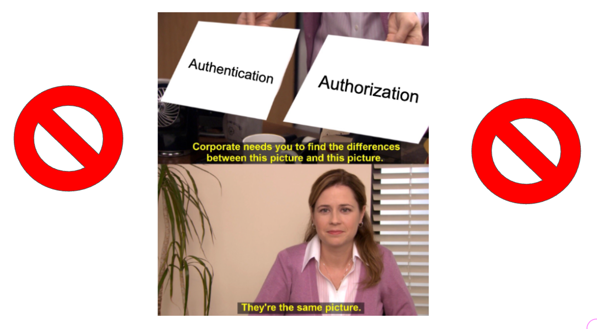
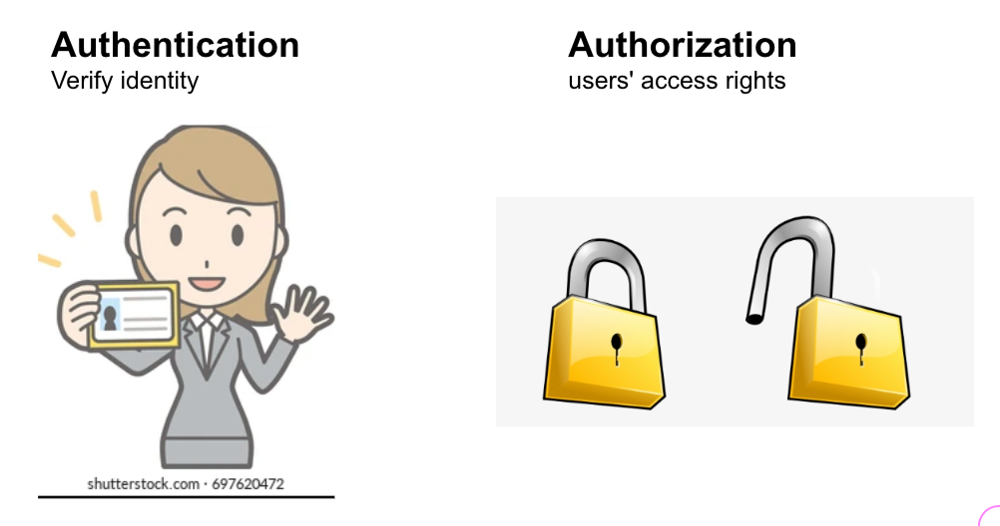
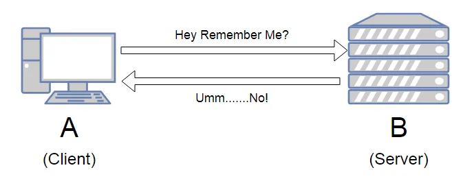
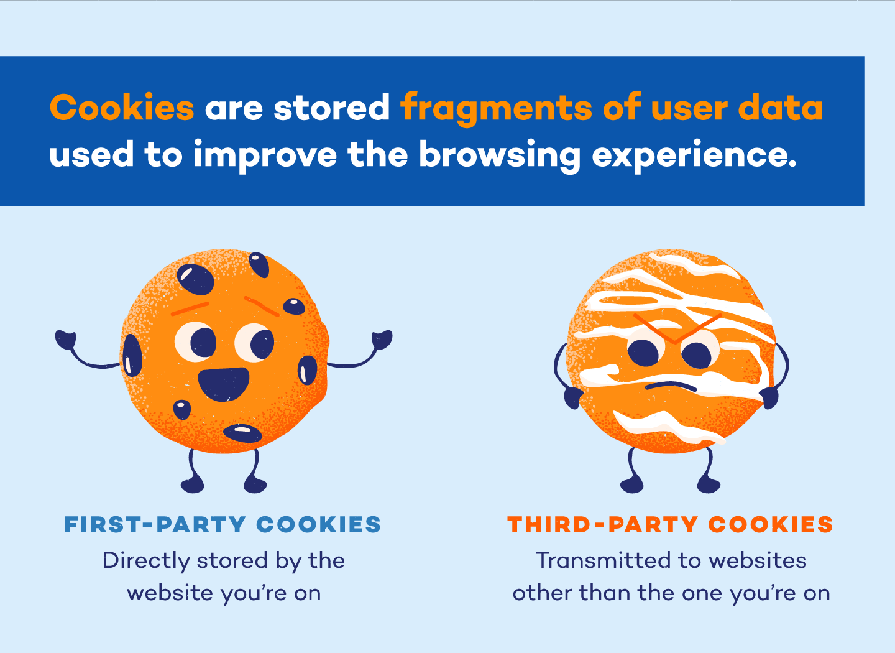
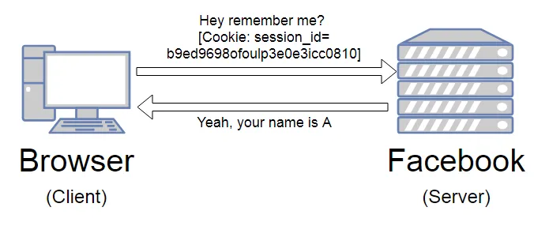
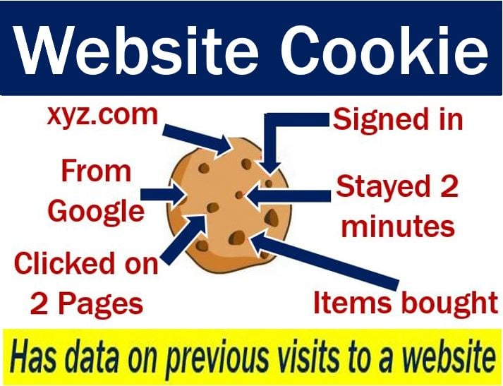
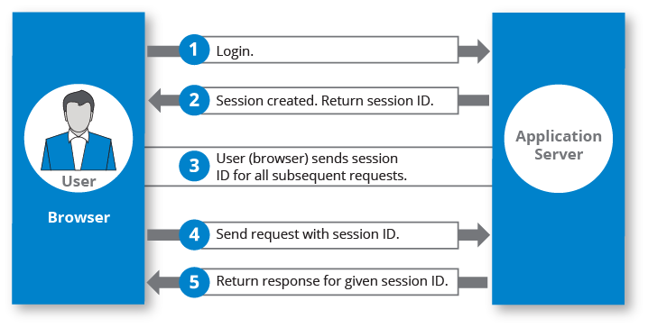

## Authentication with Flask

---

## Learning Objectives
* Understnd the Importance of Authentication in Web Apps
* Be able to differentiate between Identity Management (Authentication) and Access Management (Authorization)
* Identify Cookies and Sessions, and their relationship in the context of Authentication
* See how to implement Token-Based Authentication (Identity Management) Using Cookies and Sessions

---

### Authentication vs Authorization

---

### Identity and Access Management

---

### The Club Analogy

---

## The Stateless Protocol

[Singh M., Cookie+Session (Medium)](https://medium.com/@maheshlsingh8412/cookie-session-story-of-a-stateless-http-3cd09cc01541)

---

Since HTTP is stateless, it does not know who you are. It does not know if you are the same person who logged in 5 minutes ago or if you are a new user. 

---

##### Enter Cookies

---

##### Cookies allow us to make the HTTP request-response protocol stateful

---

### Contents of a Cookie

---

##### Uses of Cookies

###### Let's code! 💻 {.fragment}

---

### Secure the Cookies 🔒 with Sessions

